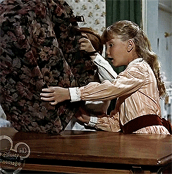

layout: true

background-image: url(immagini/logoTI_slides.png)
background-position: 1.5% 96.5%

---

```{r setup, include=FALSE}

options(htmltools.dir.version = FALSE)

knitr::opts_chunk$set(fig.width=4.25, fig.height=3.5, fig.retina=3,
                      message=FALSE, warning=FALSE, cache = TRUE, 
                      autodep = TRUE, hiline=TRUE, dev = "svg")

options(knitr.kable.NA = '')

```


class: middle clear

#### Statistica pubblica, percezioni, dati e .hl[ritorno]

--

<br>
### ***Vademecum***

1. Il *ruolo* della statistica pubblica  

--
2. Le **percezioni** individuali (valutazione soggettiva)

--
3. **Dati e metadati** (valutazione oggettiva)

--
4. Perché è importante il .hl[ritornare]?


---
class: middle clear

*Domanda:*
> "A vostro avviso nei prossimi 12 mesi quale sarà l’evoluzione del numero di disoccupati in Svizzera?"

--

<br>
*Risposte:*  

.pull-left[
.font80[
- Quasi nessuna variazione **(0)**  
- Leggero aumento **(+1)**  
- Forte aumento **(+2)**

]
]

--

.pull-right[
.font80[
- Non so **(0)**  
- Leggera diminuzione **(-1)**  
- Forte diminuzione **(-2)**

]
]

---

# Il **ruolo** della statistica pubblica

.pull-left[

.font50[
.dark-warm-grey[
*“Polarised opinion landscapes and widespread misinformation have formed in an environment where emotions and beliefs prevail over facts and evidence. Something needs to be done to **regulate** the new data ecosystem, **educate** citizens and **limit** the misuse of data information”*
]
Paris21 - [[link]](https://paris21.org/about-paris21), conferenza annuale, Berna, 04.04.2018
]
]

--

.pull-right[
##### *"La regola delle 3C"*
.font90[
1. **.hl[**C**]onfrontabile** .font80[.mid-warm-grey[*[Check]*]]  
È possibile il confronto tra percezione e dati? E il contrario?

2. **.hl[**C**]omprensibile** .font80[.mid-warm-grey[*[Understand the context]*]]  
Rispetto al contesto ha senso usare dei dati statistici

3. **.hl[**C**]onsapevoli** .font80[.mid-warm-grey[*[Be aware of the source]*]]  
Si sa da dove arriva il dato e perché si usa una determinata fonte  
]

.font50[
.mid-warm-grey[
04.04.2018 - SRF, Tagesschau, 
]]
.font70[
[*Vertrauen in öffentliche Daten immer wichtiger*](https://tp.srgssr.ch/p/portal?urn=urn:srf:ais:video:fcca4df0-83e3-4982-aaf5-62a9b9c347c5&autoplay=true&legacy=true&width=640&height=360&playerType=)
]
]

---
class: inverse, center, middle

# Un'applicazione al tema della disoccupazione <html><div style='float:left'></div><hr color='#0070C0' size=1px></html>

---
class: clear

.font90[
.left-column[
#### .hl[Quanti] sono i disoccupati iscritti?

]
]

--

.right-column[
.font50[
08 novembre 2019,
  [www.**seco**.admin.ch](https://www.seco.admin.ch/seco/it/home/Arbeit/Arbeitslosenversicherung/arbeitslosenzahlen.html) : ***"La situazione sul mercato del lavoro ottobre 2019"***
]

.font60[
> "Secondo i rilevamenti effettuati dalla Segreteria di Stato dell’economia (SECO), alla fine di ottobre 2019
erano **iscritti 101’684 disoccupati** presso gli uffici regionali di collocamento (URC), ossia 2’586 in più rispetto
al mese precedente. Il tasso di disoccupazione è salito dal 2,1% nel mese di settembre 2019 al 2,2% nel
mese in rassegna. Rispetto allo stesso mese dell’anno precedente, il numero di disoccupati è diminuito di
5’631 unità (-5,2%)."

]
]

--

.right-column[
.font50[
08 novembre 2019,
  [laRegione](https://www.laregione.ch/svizzera/svizzera/1401920/cresce-di-poco-la-disoccupazione-in-svizzera-ticino-al-2-6) : ***"Cresce (di poco) la disoccupazione in Svizzera"***
]

.font60[
> "Torna a salire, seppur leggermente, la disoccupazione in Svizzera: in ottobre il tasso dei senza lavoro si è attestato al 2,2%, contro il 2,1% di settembre, valore più basso dal 2001. Nel confronto su un anno vi è stata invece una contrazione di 0,1 punti. **I disoccupati hanno inoltre di nuovo superato la .hl[soglia psicologica] di 100mila persone, per la prima volta dal maggio scorso**."

]
]

--

.right-column[
.font70[
<br>
Chi pubblica i dati? E dove?  ]
.font60[
  
  - La segreteria di Stato per l'economia .dark-warm-grey[(Seco) ], [www.**seco**.admin.ch](https://www.seco.admin.ch/seco/it/home.html)  
  - o sul sito della statistica del mercato del lavoro .dark-warm-grey[(Amstat) ], [www.**amstat**.ch](https://www.seco.admin.ch)  
  - oppure sul sito della sezione del lavoro del Canton Ticino .dark-warm-grey[(Sdl) ], [www.ti.ch/dfe/de/**sdl**/sezione](https://www4.ti.ch/dfe/de/sdl/sezione/)
]
]

--

.right-column[
.font70[
*...oppure sul sito degli Uffici di statistica  *]
.font60[
- sito dell'Ufficio di statistica del Canton Ticino .dark-warm-grey[(Ustat) ], [www.ti.ch/**ustat**](https://www3.ti.ch/DFE/DR/USTAT/)  
- sito dell'Ufficio federale di statistica .dark-warm-grey[(Ust) ], [www.**bfs**.admin.ch](https://www.bfs.admin.ch/bfs/it/home.html)
]
]

---
class: clear

.font90[
.left-column[
#### Quanti sono i disoccupati iscritti?
#### E in Ticino?

]
]

.img-left[]

--

<br>
.right-column[
La domanda è corretta?
]

--

.right-column[
.pull-left[
SI
]

.pull-right[
.hl[NO]
]
]

--

.right-column[
La domanda non è scorretta, ma ce n'è una .hl[più] urgente
]

---
class: clear

.font90[
.left-column[
#### Quanti sono i disoccupati iscritti?
#### **.hl[Chi]** sono i disoccupati iscritti?

<br>
.img-left[]

]
]

--

.right-column[
<br>
#### **I metadati**

.font70[
> *“I *metadati*, o *data about data* sono tutte le informazioni che permettono ai numeri di parlare di farci comprendere appieno il loro significato: glossari, classificazioni, **definizioni**, **metodologia** di indagine,...”*

]
]

--

.right-column[

#### Esempio

.font70[
.mid-warm-grey[USTAT], 03.03.02 Disoccupazione  
I *disoccupati iscritti* --> [definizione](https://www3.ti.ch/DFE/DR/USTAT/index.php?fuseaction=temi.sottotema&p1=35&p2=151&p3=156&proId=155https://www3.ti.ch/DFE/DR/USTAT/index.php?fuseaction=temi.dettaglioglossario&gloId=344&p1=35&p2=166&p3=170&proId=169)

]
]

---
class: clear

.font90[
.left-column[
#### Quanti sono i disoccupati iscritti?
#### Chi sono i disoccupati iscritti?
#### Disoccupati iscritti in Svizzera e in Ticino

]
]

```{r, echo=FALSE, message=FALSE, warning=FALSE}
source(file = "Figure.R")
```

.right-column[
```{r p1, echo=FALSE, eval=TRUE, out.width= 750}
p1
```

]

---
class: clear

.font90[
.left-column[
#### Quanti sono i disoccupati iscritti?
#### Chi sono i disoccupati iscritti?
#### Disoccupati iscritti in Svizzera e in Ticino
#### Persone in cerca di impiego .hl[non] disoccupate in Svizzera e in Ticino

]
]

.right-column[
```{r p3, echo=FALSE, out.width= 750}
p3
```
]

---
class: clear

.font90[
.left-column[
#### Quanti sono i disoccupati iscritti?
#### Chi sono i disoccupati iscritti?
#### Disoccupati iscritti in Svizzera e in Ticino
#### Persone in cerca di impiego non disoccupate in Svizzera e in Ticino
#### Persone in cerca di impiego in Svizzera e in Ticino

]
]

.right-column[
```{r p4, echo=FALSE, out.width= 750}
p4
```
]

---
# I problemi possono trasformarsi in grattacapi

<br>
.font60[
23 luglio 2019,
  [www.**bfs**.admin.ch: ](https://www.bfs.admin.ch/bfs/it/home.assetdetail.9106992.html) ***"Forza lavoro potenziale: 830 000 persone sarebbero disposte a lavorare (di più)"***  
]

--

.font70[
> "Nel 2018 in Svizzera il potenziale di forza lavoro inutilizzato ammontava a 830.000 persone ed era costituito da 356.000 sottoccupati, 231.000 disoccupati e 243.000 facenti parte della «riserva di persone» (persone alla ricerca di un lavoro, ma non immediatamente disponibili e viceversa). Il volume di lavoro che i sottoccupati sarebbero stati disposti a fornire addizionato a quello dei disoccupati corrisponde a una mancanza di lavoro pari a 299.000 posti a tempo pieno."

]

--

.font60[
14 novembre 2019,
  [www.**bfs**.admin.ch: ](https://www.bfs.admin.ch/bfs/it/home/attualita/comunicati-stampa.assetdetail.10647466.html) *"Terzo trimestre 2019: il numero di occupati aumenta dello 0,3%; **il tasso di disoccupazione ai sensi dell'ILO aumenta al 4,6%**"*
]

.font70[
> "Tra il terzo trimestre del 2018 e il terzo trimestre del 2019 il numero di occupati in Svizzera è aumentato dello 0,3%. Nello stesso periodo, il tasso di disoccupazione secondo la definizione dell’Organizzazione internazionale del lavoro (ILO) è salito dal 4,4 al 4,6%."

]

---
class: middle clear

### Come approfondire e perché ha senso approfondire

.mid-warm-grey[
.font80[
Punto di partenza
]
]

--

.pull-left[
##### La cultura del pretendere
.img.left[]

]

--

.pull-right[
##### .hl[vs.] la cultura dello scoprire
.img-left[]

]

--

.pull-right[
.font70[
*Esempio*:  
Non cercare sempre e solo dei dati da commentare. Ma  
applicare la *Regola delle 3C*:
- *Confrontabile*  
- *Comprensibile*  
- *Consapevoli*

]
]

---
class: middle clear

### Risultato *ideale*

.mid-warm-grey[
.font80[
Orizzonte
]
]

--

.pull-left[
.font70[
.hl[Grazie] a una migliore conoscenza della statistica
]
##### Dalla cultura dello scoprire
.img-left[]

]

.pull-right[
.font70[
~~Cultura del pretendere~~
]
##### Alla cultura del .hl[**confronto**]
.img.left[]
]

--

.pull-right[
.font70[
[*Esempio*](
https://www4.ti.ch/fileadmin/DFE/DE-SDL/varie/disoccupazione_lettura_dati.pdf
)  
.mid-warm-grey[Origoni, Pau e Gonzalez, Oscar (2017). *"Disoccupazione: informazioni per una corretta lettura dei dati"*, Dati, statistiche e società, 1, 30-39.]

]
]

---
class: inverse, center, middle

# Torniamo allora alle percezioni <html><div style='float:left'></div><hr color='#0070C0' size=1px></html>

---
class: clear

.font90[
.left-column[
#### Disoccupati ai sensi dell'ILO .hl[vs.] disoccupati iscritti
]
]


.right-column[
```{r p5, echo=FALSE, out.width= 750}
p5
```
]

---
class: clear

.font90[
.left-column[
#### Disoccupati iscritti vs. disoccupati ai sensi dell'ILO
#### .hl[Percezione] dell'evoluzione della disoccupazione

]
]

--

.right-column[
```{r p6, echo=FALSE, out.width= 750}
p6
```
]


---
# C'era una volta... la statistica magica

.font80[
.pull-left[
###### Prima del corso
#### Il mondo della statistica era un po' magico

]
]

.pull-right[
.img-left[]

]

---
# La regola delle 3C

.font80[
.left-column[
#### **PRIMA:** il mondo della statistica era un po' magico
#### **ORA:** è un po' meno magico e un po' più attrattivo
<br>
.img-left[]
]
]

--

.right-column[
##### La regola delle 3C
##### .mid-warm-grey[CUBe's rule: `*Check, understand, be aware*`]
1. .hl[**C**onfrontabile], dato e percezioni sono confrontabili? E il contrario?  
.mid-warm-grey[*[**C**heck]*]  
2. .hl[**C**omprensibile], l'uso dei dati ha senso rispetto al contesto?  
.mid-warm-grey[*[**U**nderstand  the context]*]  
3. .hl[**C**onsapevoli], sappiamo perché stiamo usando questa fonte di dati?  
.mid-warm-grey[*[**Be** aware of the source]*]

]

---
# Pronti a... ballare

.font80[
.left-column[
#### Dalla cultura del pretendere
#### Alla cultura del confronto
#### Ultimissimo ripasso e contatti

]
]


.right-column[

  

Il salto culturale, cioè passare dalla cultura del pretendere alla cultura del .hl[confronto] è qualcosa di più di un semplice *make-up*, per farlo bisogna mettersi prima in discussione e poi in gioco .font60[.mid-warm-grey[*[autore sconosciuto]*]]


.font70[
<br>
<br>
per qualsiasi ulteriore domanda   
[eric.stephani@ti.ch](mailto:eric.stephani@ti.ch)  
<br>
.mid-warm-grey[
Slides create con R, via [**{xaringan}**](https://github.com/yihui/xaringan)
]
]
]
